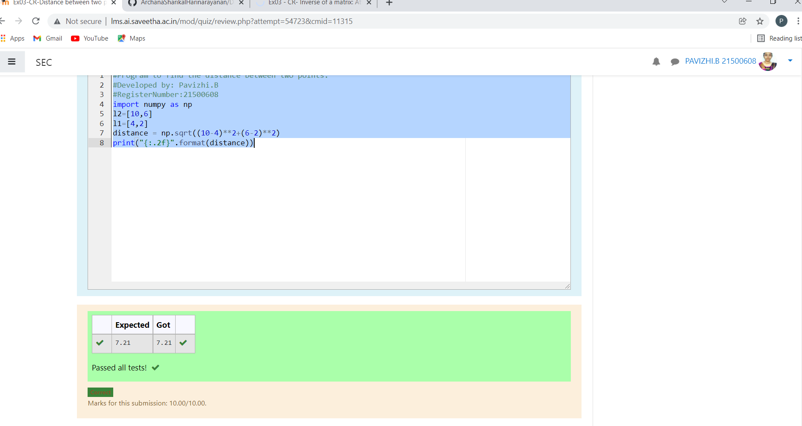

# DISTANCE-BETWEEN-TWO-POINTS

## AIM:
To write a python program to find the distance two 2 points
## ALGORITHM:
### Step 1:
Define the function to find the distance between two points. 
### Step 2:
Assign the values in list. 
### Step 3: 
Substitute the values in the distance formula  
### Step 4:
Using the distance format print the result. 
### Step 5: 
End the program.
### PROGRAM:
```
#Program to find the distance between two points.
#Developed by: Pavizhi.B
#RegisterNumber:21500608
import numpy as np
l2=[10,6]
l1=[4,2]
distance = np.sqrt((10-4)**2+(6-2)**2)
print("{:.2f}".format(distance))
```
  ### OUTPUT:
 

### RESULT:
Thus finding the distance between two points is executed.